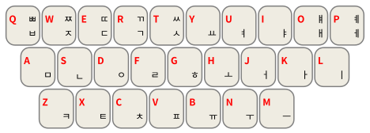

# 少数民族文字输入法方案合集

由 [Martin的杂货铺](https://github.com/martinSCS) 设计编码

## 设计背景

在当今主流操作系统中，我们很难获取到我国少数民族文字的语言和文字输入支持；即使获取到，对于初学者来说也非常难以上手。在看到汉语拼音方案对汉字输入门槛的降低能力之后，我着手开始设计一些基于拉丁转写的少数民族文字的输入方案。同时考虑到针对部分文字的形码输入法可能已经有广泛使用，对于这部分文字设计了接近其形码输入法的输入方案

## 方案内容

方案已经覆盖了5种少数民族文字，共6套输入方案。以下为支持的文字和方案列表。

- 维吾尔文&#9;`ug-Arab`
- 哈萨克文&#9;`kk-Arab`
- 传统蒙古文&#9;`mn-Mong`
- 凉山规范彝文&#9;`ii-Yiii`
- 朝鲜文&#9;`ko-Hang` `ko-Kore`

## 各方案介绍

### 维吾尔文

维吾尔文输入法的键码基于[拉丁维吾尔文](https://zh.wikipedia.org/wiki/%E6%8B%89%E4%B8%81%E7%BB%B4%E6%96%87)设定，使用拉丁转写来降低记忆难度。输入法配备了12万词库，但可能不包括附带黏着成分的词。其中“ۈ”“ې”“ۆ”等的拉丁转写分别为在u、e、o后加一个v。以“ئ&zwj;”开头的元音字母需要使用对应拉丁字母的大写字母，例如“ئا”应当使用“A”来转写，“ئۈ”应当使用“Uv”来转写。不过在词库中已有的词，可以直接使用小写字母替换。

### 哈萨克文

哈萨克文输入法的键码基于自定义的拉丁哈萨克文设定，使用拉丁转写来降低记忆难度。转写规则参考如下表格：

    
点此展开

    <table>
        <thead>
            <tr><td>字母</td><td>转写</td></tr>
        </thead>
        <tbody>
            <tr><td>ا</td><td>a</td></tr>
            <tr><td>ٵ</td><td>A</td></tr>
            <tr><td>ب</td><td>b</td></tr>
            <tr><td>ۆ</td><td>v</td></tr>
            <tr><td>گ</td><td>g</td></tr>
            <tr><td>ع</td><td>gh</td></tr>
            <tr><td>د</td><td>d</td></tr>
            <tr><td>ە</td><td>e</td></tr>
            <tr><td>ج</td><td>j</td></tr>
            <tr><td>ز</td><td>z</td></tr>
            <tr><td>ٸ</td><td>I</td></tr>
            <tr><td>ي</td><td>y</td></tr>
            <tr><td>ك</td><td>k</td></tr>
            <tr><td>ق</td><td>q</td></tr>
            <tr><td>ل</td><td>l</td></tr>
            <tr><td>م</td><td>m</td></tr>
            <tr><td>ن</td><td>n</td></tr>
            <tr><td>ڭ</td><td>ng</td></tr>
            <tr><td>و</td><td>o</td></tr>
            <tr><td>ٶ</td><td>O</td></tr>
            <tr><td>پ</td><td>p</td></tr>
            <tr><td>ر</td><td>r</td></tr>
            <tr><td>س</td><td>s</td></tr>
            <tr><td>ت</td><td>t</td></tr>
            <tr><td>ۋ</td><td>w</td></tr>
            <tr><td>ۇ</td><td>u</td></tr>
            <tr><td>ٷ</td><td>U</td></tr>
            <tr><td>ف</td><td>f</td></tr>
            <tr><td>ح</td><td>x</td></tr>
            <tr><td>ھ</td><td>h</td></tr>
            <tr><td>چ</td><td>ch</td></tr>
            <tr><td>ش</td><td>sh</td></tr>
            <tr><td>ى</td><td>i</td></tr>
            <tr><td>ء</td><td>'</td></tr>
        </tbody>
    </table>

其中，部分大写字母用于表示带hamza的元音，一般不用于单词中，只用于单独指示字母时使用。

### 传统蒙古文

蒙古文输入法的键码基于[中蒙联合转写](https://zh.wikipedia.org/wiki/%E4%B8%AD%E8%92%99%E8%81%94%E5%90%88%E8%BD%AC%E5%86%99)中的胡都木转写改编。转写规则参考如下表格：

    
点此展开

    <table>
        <thead>
            <tr><td>字母</td><td>转写</td></tr>
        </thead>
        <tbody>
            <tr><td style="writing-mode: vertical-lr; font-size: 2em">᠐</td><td>/0</td></tr>
            <tr><td style="writing-mode: vertical-lr; font-size: 2em">᠑</td><td>/1</td></tr>
            <tr><td style="writing-mode: vertical-lr; font-size: 2em">᠒</td><td>/2</td></tr>
            <tr><td style="writing-mode: vertical-lr; font-size: 2em">᠓</td><td>/3</td></tr>
            <tr><td style="writing-mode: vertical-lr; font-size: 2em">᠔</td><td>/4</td></tr>
            <tr><td style="writing-mode: vertical-lr; font-size: 2em">᠕</td><td>/5</td></tr>
            <tr><td style="writing-mode: vertical-lr; font-size: 2em">᠖</td><td>/6</td></tr>
            <tr><td style="writing-mode: vertical-lr; font-size: 2em">᠗</td><td>/7</td></tr>
            <tr><td style="writing-mode: vertical-lr; font-size: 2em">᠘</td><td>/8</td></tr>
            <tr><td style="writing-mode: vertical-lr; font-size: 2em">᠙</td><td>/9</td></tr>
            <tr><td style="writing-mode: vertical-lr; font-size: 2em">ᠠ</td><td>a</td></tr>
            <tr><td style="writing-mode: vertical-lr; font-size: 2em">ᠡ</td><td>e</td></tr>
            <tr><td style="writing-mode: vertical-lr; font-size: 2em">ᠢ</td><td>i</td></tr>
            <tr><td style="writing-mode: vertical-lr; font-size: 2em">ᠣ</td><td>o</td></tr>
            <tr><td style="writing-mode: vertical-lr; font-size: 2em">ᠤ</td><td>u</td></tr>
            <tr><td style="writing-mode: vertical-lr; font-size: 2em">ᠥ</td><td>O</td></tr>
            <tr><td style="writing-mode: vertical-lr; font-size: 2em">ᠦ</td><td>U</td></tr>
            <tr><td style="writing-mode: vertical-lr; font-size: 2em">ᠧ</td><td>E</td></tr>
            <tr><td style="writing-mode: vertical-lr; font-size: 2em">ᠨ</td><td>n</td></tr>
            <tr><td style="writing-mode: vertical-lr; font-size: 2em">ᠩ</td><td>ng</td></tr>
            <tr><td style="writing-mode: vertical-lr; font-size: 2em">ᠪ</td><td>b</td></tr>
            <tr><td style="writing-mode: vertical-lr; font-size: 2em">ᠫ</td><td>p</td></tr>
            <tr><td style="writing-mode: vertical-lr; font-size: 2em">ᠬ</td><td>x</td></tr>
            <tr><td style="writing-mode: vertical-lr; font-size: 2em">ᠭ</td><td>g</td></tr>
            <tr><td style="writing-mode: vertical-lr; font-size: 2em">ᠮ</td><td>m</td></tr>
            <tr><td style="writing-mode: vertical-lr; font-size: 2em">ᠯ</td><td>l</td></tr>
            <tr><td style="writing-mode: vertical-lr; font-size: 2em">ᠰ</td><td>s</td></tr>
            <tr><td style="writing-mode: vertical-lr; font-size: 2em">ᠱ</td><td>sh</td></tr>
            <tr><td style="writing-mode: vertical-lr; font-size: 2em">ᠲ</td><td>t</td></tr>
            <tr><td style="writing-mode: vertical-lr; font-size: 2em">ᠳ</td><td>d</td></tr>
            <tr><td style="writing-mode: vertical-lr; font-size: 2em">ᠴ</td><td>ch</td></tr>
            <tr><td style="writing-mode: vertical-lr; font-size: 2em">ᠵ</td><td>j</td></tr>
            <tr><td style="writing-mode: vertical-lr; font-size: 2em">ᠶ</td><td>y</td></tr>
            <tr><td style="writing-mode: vertical-lr; font-size: 2em">ᠷ</td><td>r</td></tr>
            <tr><td style="writing-mode: vertical-lr; font-size: 2em">ᠸ</td><td>w</td></tr>
            <tr><td style="writing-mode: vertical-lr; font-size: 2em">ᠸ</td><td>v</td></tr>
            <tr><td style="writing-mode: vertical-lr; font-size: 2em">ᠹ</td><td>f</td></tr>
            <tr><td style="writing-mode: vertical-lr; font-size: 2em">ᠺ</td><td>G</td></tr>
            <tr><td style="writing-mode: vertical-lr; font-size: 2em">ᠻ</td><td>k</td></tr>
            <tr><td style="writing-mode: vertical-lr; font-size: 2em">ᠼ</td><td>c</td></tr>
            <tr><td style="writing-mode: vertical-lr; font-size: 2em">ᠽ</td><td>z</td></tr>
            <tr><td style="writing-mode: vertical-lr; font-size: 2em">ᠾ</td><td>h</td></tr>
            <tr><td style="writing-mode: vertical-lr; font-size: 2em">ᠿ</td><td>zh</td></tr>
            <tr><td style="writing-mode: vertical-lr; font-size: 2em">ᡀ</td><td>lh</td></tr>
            <tr><td style="writing-mode: vertical-lr; font-size: 2em">ᡁ</td><td>Zh</td></tr>
            <tr><td style="writing-mode: vertical-lr; font-size: 2em">ᡂ</td><td>Ch</td></tr>
            <tr><td style="writing-mode: vertical-lr; font-size: 2em">ᡛ</td><td>N</td></tr>
            <tr><td style="writing-mode: vertical-lr; font-size: 2em">ᢀ</td><td>//m</td></tr>
            <tr><td style="writing-mode: vertical-lr; font-size: 2em">ᢁ</td><td>//h</td></tr>
            <tr><td style="writing-mode: vertical-lr; font-size: 2em">ᢂ</td><td>//A</td></tr>
            <tr><td style="writing-mode: vertical-lr; font-size: 2em">ᢃ</td><td>//O</td></tr>
            <tr><td style="writing-mode: vertical-lr; font-size: 2em">ᢄ</td><td>//OO</td></tr>
            <tr><td style="writing-mode: vertical-lr; font-size: 2em">ᢅ</td><td>//'</td></tr>
            <tr><td style="writing-mode: vertical-lr; font-size: 2em">ᢆ</td><td>//:'</td></tr>
            <tr><td style="writing-mode: vertical-lr; font-size: 2em">ᢇ</td><td>//a</td></tr>
            <tr><td style="writing-mode: vertical-lr; font-size: 2em">ᢈ</td><td>//i</td></tr>
            <tr><td style="writing-mode: vertical-lr; font-size: 2em">ᢉ</td><td>//k</td></tr>
            <tr><td style="writing-mode: vertical-lr; font-size: 2em">ᢊ</td><td>//ng</td></tr>
            <tr><td style="writing-mode: vertical-lr; font-size: 2em">ᢋ</td><td>//c</td></tr>
            <tr><td style="writing-mode: vertical-lr; font-size: 2em">ᢌ</td><td>//tt</td></tr>
            <tr><td style="writing-mode: vertical-lr; font-size: 2em">ᢍ</td><td>//tth</td></tr>
            <tr><td style="writing-mode: vertical-lr; font-size: 2em">ᢎ</td><td>//dd</td></tr>
            <tr><td style="writing-mode: vertical-lr; font-size: 2em">ᢏ</td><td>//nn</td></tr>
            <tr><td style="writing-mode: vertical-lr; font-size: 2em">ᢐ</td><td>//t</td></tr>
            <tr><td style="writing-mode: vertical-lr; font-size: 2em">ᢑ</td><td>//d</td></tr>
            <tr><td style="writing-mode: vertical-lr; font-size: 2em">ᢒ</td><td>//p</td></tr>
            <tr><td style="writing-mode: vertical-lr; font-size: 2em">ᢓ</td><td>//ph</td></tr>
            <tr><td style="writing-mode: vertical-lr; font-size: 2em">ᢔ</td><td>//ss</td></tr>
            <tr><td style="writing-mode: vertical-lr; font-size: 2em">ᢕ</td><td>//zh</td></tr>
            <tr><td style="writing-mode: vertical-lr; font-size: 2em">ᢖ</td><td>//zh</td></tr>
            <tr><td style="writing-mode: vertical-lr; font-size: 2em">ᢗ</td><td>//ah</td></tr>
            <tr><td style="writing-mode: vertical-lr; font-size: 2em">ᢦ</td><td>//u</td></tr>
            <tr><td style="writing-mode: vertical-lr; font-size: 2em">ᢧ</td><td>//y</td></tr>
        </tbody>
    </table>

蒙古文专用标点输入法键码参考如下表格：

    
点此展开

    <table>
        <thead>
            <tr><td>输入码</td><td>可选标点</td></tr>
        </thead>
        <tbody>
            <tr><td rowspan="2">&amp;</td><td style="writing-mode: vertical-lr; font-size: 1.3em; text-align: center;">᠀</td></tr>
            <tr><td style="font-size: 1.3em; text-align: center;">&amp;</td></tr>
            <tr><td rowspan="3">^</td><td style="writing-mode: vertical-lr; font-size: 1.3em; text-align: center;">᠁</td></tr>
            <tr><td style="text-align: center;">零宽非连接符[ZWNJ]</td></tr>
            <tr><td style="font-size: 1.3em; text-align: center;">^</td></tr>
            <tr><td rowspan="2">,</td><td style="writing-mode: vertical-lr; font-size: 1.3em; text-align: center;">᠂</td></tr>
            <tr><td style="font-size: 1.3em; text-align: center;">,</td></tr>
            <tr><td rowspan="2">.</td><td style="writing-mode: vertical-lr; font-size: 1.3em; text-align: center;">᠃</td></tr>
            <tr><td style="font-size: 1.3em; text-align: center;">.</td></tr>
            <tr><td rowspan="2">:</td><td style="writing-mode: vertical-lr; font-size: 1.3em; text-align: center;">᠄</td></tr>
            <tr><td style="font-size: 1.3em; text-align: center;">:</td></tr>
            <tr><td rowspan="2">#</td><td style="writing-mode: vertical-lr; font-size: 1.3em; text-align: center;">᠅</td></tr>
            <tr><td style="font-size: 1.3em; text-align: center;">#</td></tr>
            <tr><td rowspan="3">-</td><td style="writing-mode: vertical-lr; font-size: 1.3em; text-align: center;">᠊</td></tr>
            <tr><td style="text-align: center;">窄不间断空格[NNBSP]</td></tr>
            <tr><td style="font-size: 1.3em; text-align: center;">-</td></tr>
            <tr><td rowspan="5">'</td><td style="text-align: center;">蒙古文自由变体选择符1[FVS1]</td></tr>
            <tr><td style="text-align: center;">蒙古文自由变体选择符2[FVS2]</td></tr>
            <tr><td style="text-align: center;">蒙古文自由变体选择符3[FVS3]</td></tr>
            <tr><td style="text-align: center;">蒙古文自由变体选择符4[FVS4]</td></tr>
            <tr><td style="font-size: 1.3em; text-align: center;">'</td></tr>
            <tr><td rowspan="2">`</td><td style="text-align: center;">蒙古文元音分隔符[MVS]</td></tr>
            <tr><td style="font-size: 1.3em; text-align: center;">`</td></tr>
            <tr><td rowspan="2">_</td><td style="writing-mode: vertical-lr; font-size: 1.3em; text-align: center;">&#x18a9;</td></tr>
            <tr><td style="font-size: 1.3em; text-align: center;">_</td></tr>
            <tr><td rowspan="2">*</td><td style="text-align: center;">零宽连接符[ZWJ]</td></tr>
            <tr><td style="font-size: 1.3em; text-align: center;">*</td></tr>
        </tbody>
    </table>

### 凉山规范彝文

凉山规范彝文参考[拉丁化彝文表](https://zh.wikipedia.org/wiki/%E5%BD%9D%E6%96%87)，也可参考下图。

### 朝鲜文

参考当今国际接受度最广的二套式（두벌식，dubeol-sik）键盘。参考图如下：

